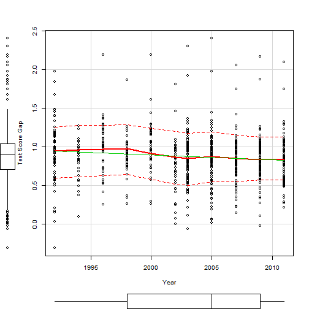
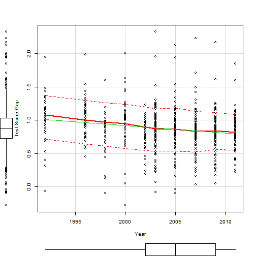

Coursera Developing Data Products Presentation
========================================================
author: Demetra Kalogrides
date: August 11, 2014

My First Shiny App
========================================================

My app creates a bubble chart showing the test score gap between
white and black students over time. 

- Uses data from the National Assessment of Educational Progress
- Shows test score gaps separately by state, year and test subject
- Allows users to display results separately for 4th and 8th graders
- The app is available here: http://dkalogrides.shinyapps.io/MyApp/
- The code is availble here: https://github.com/dkalogrides/ShinyApp


Number of Observations
========================================================
Data are available for math and reading and in 4th and 8th grade. The following table shows the number of state by year observations for each subject and grade combination. 

```
   
    math read
  4  428  470
  8  462  380
```
Fitted Trend
========================================================
The app also estimates a regression for each grade and outputs the coefficient showing the average annual within state change in the test score gaps. 

The average annual change in the gap for 4th graders is: 

```
[1] -0.005945
```
The average annual change in the gap for 8th graders is: 

```
[1] -0.008206
```
Test Score Gaps by State, Year and Subject for 4th Graders
========================================================

 
Test Score Gaps by State, Year and Subject for 8th Graders
========================================================

 
